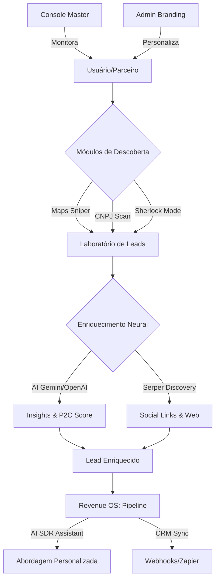

# 🚀 Documentação Completa de Funcionalidades - LeadPro Matrix

Bem-vindo ao guia mestre do ecossistema **LeadPro**. Este documento detalha todos os módulos, fluxos de dados e capacidades tecnológicas da plataforma.

---

## 🏗️ 1. Arquitetura Neural e Multi-Tenancy
O sistema opera sob uma arquitetura **Multi-Tenant nativa**, garantindo isolamento total de dados e personalização completa.

### Fluxograma do Ecossistema

*   **Isolamento Nuclear:** Cada cliente (parceiro) possui um `tenant_id` único. As políticas de **Row Level Security (RLS)** no Supabase impedem qualquer vazamento de dados entre empresas.
*   **White Label Engine:** O sistema detecta o subdomínio ou domínio customizado e carrega instantaneamente a identidade visual (logos, cores, nomes) e as chaves de API (Gemini, OpenAI, Serper) específicas daquela organização.
*   **Matrix Core:** Desenvolvido em React 19 + TypeScript para performance extrema.

---

## 🛰️ 2. Módulo: Neural Discovery (Extração Sniper)
O coração da geração de leads. Este módulo utiliza múltiplos "Motores de Varredura" para localizar alvos qualificados.

### A. Google Maps Discovery
*   **O que faz:** Varre o Google Maps em tempo real buscando empresas por nicho e localização.
*   **Fluxo Técnico:** Integração com **Serper.dev** para extrair dados geolocalizados que superam a busca comum.
*   **Dados Capturados:** Nome, Telefone (com link direto WhatsApp), Website, Endereço, Rating e Reviews.

### B. CNPJ Gov Mass Scan
*   **O que faz:** Acesso direto à base governamental de empresas.
*   **Fluxo Técnico:** Utiliza Dorks avançados para localizar CNPJs e, em seguida, consulta APIs oficiais (**BrasilAPI, ReceitaWS**) para normalizar os dados.
*   **Diferencial:** Identifica Data de Abertura, Capital Social, CNAE e Sócios.

### C. Protocolo Sherlock (Espionagem de Concorrentes)
*   **O que faz:** Localiza clientes que estão interagindo ou reclamando de seus concorrentes nas redes sociais ou sites como ReclameAqui.
*   **Fluxo Técnico:** IA analisa snippets de busca para identificar perfis de pessoas físicas ou jurídicas em "momento de dor" com a concorrência.

---

## 🧬 3. Módulo: Revenue Intelligence Lab
Transforma dados brutos em inteligência comercial utilizando modelos de linguagem de larga escala (LLMs).

*   **Enriquecimento Social:** Busca automática por perfis de Instagram, Facebook e LinkedIn.
*   **Recuperação de E-mail Real (Anti-Contab):** O sistema utiliza IA para extrair o e-mail real da diretoria/vendas, ignorando contabilidades.
*   **P2C Score (Probability to Close):** A IA avalia o fôlego financeiro e maturidade digital do lead, prevendo a probabilidade de fechamento.
*   **Strategic Insights:** Gera automaticamente uma análise de como gerar receita imediata com aquele lead específico.

---

## 🚀 4. Módulo: Revenue OS (Pipeline & SDR)
O sistema de gestão de vendas definitivo para escala.

*   **Sales Pipeline:** Kanban inteligente com valor ponderado de pipeline baseado no P2C.
*   **AI SDR Assistant:** Motor de prospecção que gera mensagens de abordagem (WhatsApp/Email) personalizadas com base nos insights neurais do lead.
*   **Conversão de Lead em Deal:** Fluxo direto do laboratório para o pipeline com um clique.

---

## 🤖 5. Módulo: Automation Worker (Supabase Edge Function)
O cérebro autônomo que processa as cadências em segundo plano.

*   **Trigger Neural:** Monitora inscrições pendentes (`next_action_at`).
*   **Handoff de Notificações:** Quando uma etapa é atingida, o worker gera automaticamente uma notificação de ação para o usuário.
*   **Gestão de Estado:** Atualiza automaticamente o passo atual da cadência e agenda a próxima interação.

---

---

## 👑 5. Gestão e Controle (Admin)

### White Label Admin (Parceiro)
*   Customização de Cores (Primary, Secondary, Accent).
*   Gestão de DNS e Domínios Customizados.
*   Controle de Créditos e API Keys próprias.
*   Logotipo e Favicon dinâmicos.

### Master Console (Dono da Plataforma)
*   **Monitoramento Global:** Visualização de todos os tenants ativos.
*   **Logs de Atividade:** Auditoria em tempo real de quem está extraindo o quê.
*   **Gestão de Infraestrutura:** Controle de versões da matriz neural e balanceamento de carga das APIs.

---

## 🔗 6. Integrações e Webhooks
Exportação nativa de dados para o ecossistema comercial global.

*   **Nativo:** Formatação pronta para CSV (Geral e Segmentado).
*   **Webhooks:** Disparos automáticos via POST JSON para qualquer URL sempre que um lead é enriquecido.
*   **Zappier / Make:** Integração "Plug & Play" para mais de 5.000 aplicativos.

---

## 🛠️ Fluxo de Trabalho do Usuário (Standard Operating Procedure)

1.  **DESCOBERTA:** O usuário insere "Nicho" + "Local" na aba Extração.
2.  **INTELIGÊNCIA:** Os leads caem no **Laboratório**, onde são enriquecidos neuralmente e recebem o Score P2C.
3.  **GESTÃO:** Leads qualificados são convertidos em **Deals** no Revenue OS (Pipeline).
4.  **ATIVAÇÃO:** O **AI SDR** gera a abordagem perfeita e o usuário inicia o contato via WhatsApp para fechar o negócio.

---
*Atualizado em: 23/02/2026*
